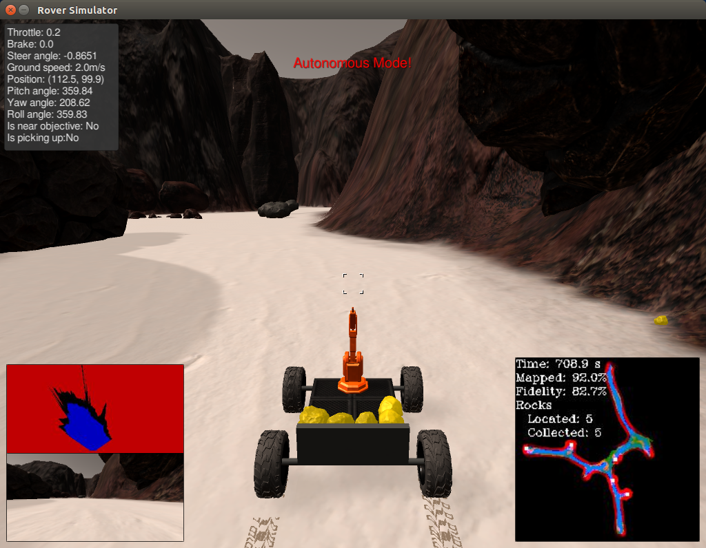

# RoboND Search and Sample Return Project

## Notebook Analysis

**NOTE**  This project was written using command line tools with little use of Jupyter notebook.  Most of the writeup is therefore contained in the next section.

Code is added to the Color Thresholding section for obstacle and rock detection.  Obstacles are detected using below threshold of [110,110,110] to create a guardband between navigable and obstacle.  Rocks are detected with R > 100, G > 100, B < 80 based on empirical results.

process_image() is updated to incorporate the perspective transform source and destination points, warping, color thresholding and coordinate transforms from the notebook.  The worldmap is built like the example but with fixed values of 128, which behaved best in the notebook at the time of the writeup.  The output is quite different from the simulator output.

## Autonomous Navigation and Mapping

### Settings

Simulator was run at 1024x768, Good quality

### Perception

Detection of navigable, obstacle, and gold grid cells uses the thresholding described above.  A guardband is included between navigable and obstacle to reduce the scale of the obstacle count somewhat.  This may not be necessary but was useful for the routing at one point.  Rocks are further detected at both the default 10 pixel per meter resolution and a higher 100 pixel per meter resolution.  The higher resolution is used to fine-tune the rock retrieval routing.

### Drive-Rover

A block of additonal state is added to RoverState __init__.  Also, member functions for transition between modes are added to the class.  Variables are added for progresss detection, to convey instructions during mode change, and for searching and routing related maps.

### Decision

decision.py contains most of the autonomous operation code.  The initial *forward* mode is used for exploring, and the steering angle here is modified to bias toward the right.  This helps the rover explore the perimeter of the search area.  Progress is checked and an *escape* mode is used to rotate and backup until the rover can move again.  If gold is spotted, a mission mode targets the location.  Most of the driving is done using geometry since the map is being discovered along the way and this creates difficulty for detailed routing.  Once the angle to target fails, as at an obstacle, a simple router is used in the *move_xy* mode.  The goal of this mode is to get the rover to a grid cell.  A path is generated on each call and the rover is directed toward the next step on the path.  Since there is a lot of ambiguity in the ability to move on many of the grid cells, getting this to work required some effort.  In particular, an extra array is maintained to flag cell to cell directional motion attempts that were blocked.  The router should therefore learn to select another path *assuming it has navigable grid cells available.*  Navigable and obstacle detections overlap to a large degree and therefore the router uses the ratio of obstacle to navigable count in the map as a cost function.  This should result in higher probability routes but in practice getting around tight spaces involves a lot of on the fly learning about sub-meter protrusions of rocks into otherwise open grid cells.

Once the rover is close to a gold sample, *collect* mode fine tunes the position using *move_xy*, *rotate* and geometric steering toward the high-resolution sample location from perception.  There is a lot of noise in the detailed positioning of the rover, but the process usually converges.  Driving over the gold rocks was fairly straightforward; stopping next to and retrieving them was another matter.  After collecting a sample, the rover resumes it pre-mission heading to avoid leaving large sections of the map unexplored.  This could happen because the exploring done by *forward* is a simple geometric operation with no concept of the map.

### Collecting Rocks

## Next Steps

Most of the time was spent on gold retrieval, so the rover remains a bit daft about things like boulders in its path.  The router could be used to avoid obstacles more effectively.  Also, gold sometimes appears in awkward corners of the map that are easily missed by the simple exploration protocol.  The router could be used to explore projections of the map.  This would open the map as the rover's camera approaches and could be used to get into most of the corners.  The data structure is present but not used for this purpose.

 